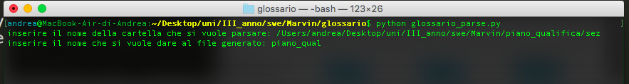

# Guida per l'utilizzo dello script glossario_parse.py

glossario_parse.py è uno script che permette di estrarre in un file i termini di glossario dei
documenti .tex presenti in una data cartella.

Come prima cosa è necessario aver installato python sulla propria macchina.
Dopodiché bisogna spostarsi da terminale dentro alla cartella dove è stato posizionato lo script
(nel nostro caso *glossario*).

Bisogna poi lanciare il comando *python glossario_parse.py* .

Ci sarà così richiesto di inserire il percorso della cartella dove sono contenuti i file .tex da controllare.

Bisognerà poi come ultima cosa, specificare il nome del file (non mettete l'estensione perché tanto viene creato un file *.txt*) che conterrà tutti i termini di glossario (doppioni inclusi) che
sono stati trovati nei vari file *.tex*.

**N.B.: lo script non controlla se esistono già file che hanno lo stesso nome di quello che si vuole creare, è quindi necessario controllare che non esistano già file con tale nome perché altrimenti, verranno sovrascritti**.

**N.B.2: per ora non viene fatto alcun controllo sugli errori (es: il percorso dato non esiste). Sarà da implementare in futuro**

Se richiesto si potrà provvedere ad apportare eventuali migliorie allo script. 